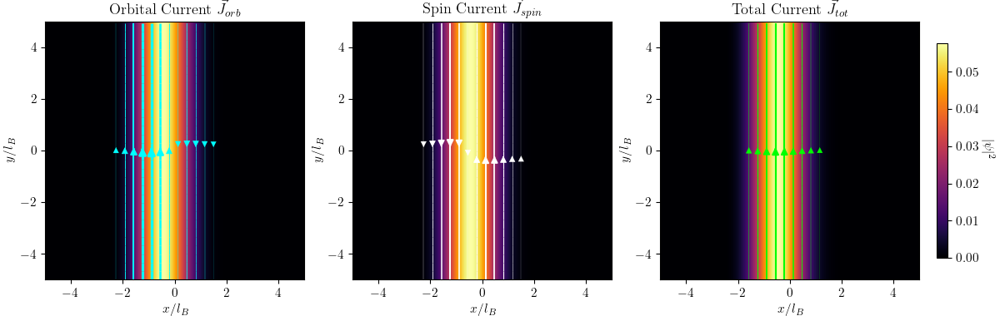
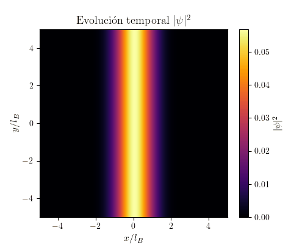

# Quantum Dynamics in a Magnetic Field (Bachelor's Thesis)

Computational simulations for a two-component (spin-1/2) quantum particle or Bose-Einstein Condensate (BEC) in a Quantum Hall effect setup. This repository contains the numerical methods used to compute the ground-state dynamics, probability currents, and real-time evolution of the system.

This work is carried out as a computational complement to my Bachelor's Degree Thesis in Physics.

## 🧠 Physical Model

The system is modeled in a 2D grid and subjected to an external perpendicular magnetic field $B$, an in-plane electric field $E$, and a confining potential well. The dynamics are governed by the Pauli equation with a non-linear Gross-Pitaevskii interaction term. 

The Hamiltonian of the system is given by:

$$H = \frac{1}{2m}(\vec{p} - q\vec{A})^2 + V_{trap}(\vec{r}) + g|\psi|^2 - \frac{\hbar q B}{2m}\sigma_z + q A_t$$

Where minimal coupling is implemented using the Landau gauge $\vec{A} = (0, Bx)$. Spatial derivatives are computed with high precision using spectral methods (Fast Fourier Transform).

### Probability Currents
A core focus of this project is the study of probability currents in spin systems. The total current is split into:
* **Orbital Current:** $\vec{J}_{orb} = \frac{1}{2m} \left( \psi^\dagger(\hat{\vec{p}} - q\vec{A})\psi + h.c. \right)$
* **Spin Current:** $\vec{J}_{spin} = \frac{\hbar}{2m} \nabla \times (\psi^\dagger \vec{\sigma} \psi)$

## ✨ Key Features

1.  **Ground-state computation:** Implementation of an Imaginary Time Evolution algorithm to find the lowest energy state of the system.
2.  **Current Analysis:** Calculation and vector-field visualization (streamplots) of both orbital and spin currents.
3.  **Real-Time Dynamics:** Time evolution of the wave packet using a 4th-order Runge-Kutta (RK4) solver to observe the effects of sudden external field shifts.

## 📊 Results & Visualizations

*(Note: Add your images here! You can drag and drop your `.png` or `.gif` files right into the GitHub editor to generate the links)*

* **Spin Probability Currents:**
   
 

* **Time Evolution (RK4):**
  
  *(Replace the link above with the actual path to your uploaded GIF)*

## 📂 Repository Structure

* `notebooks/`: Contains the unified Jupyter Notebook (`Jupyter_notebook_state_currents_and_evolution.ipynb`) with the complete, interactive workflow. **Start here.**
* `scripts/`: Original modular Python scripts used for specific calculations (Imaginary time, current analysis, time evolution).
* `figures/`: High-quality plots and animations generated by the simulations.

## 🚀 Usage and Dependencies

To run the notebook or scripts locally, you will need standard scientific Python libraries:
* `numpy`
* `matplotlib`
* `scipy`

Simply clone the repository and run the Jupyter Notebook to see the code, formulas, and visual outputs seamlessly integrated.
