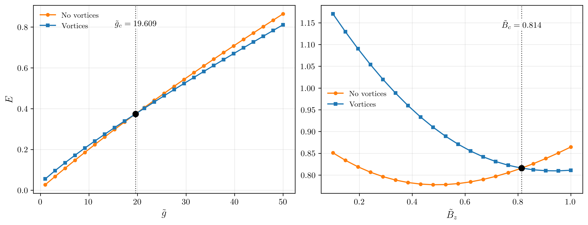
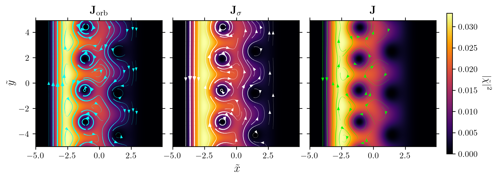
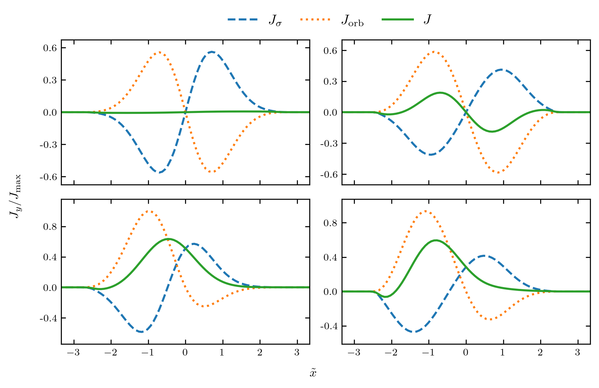
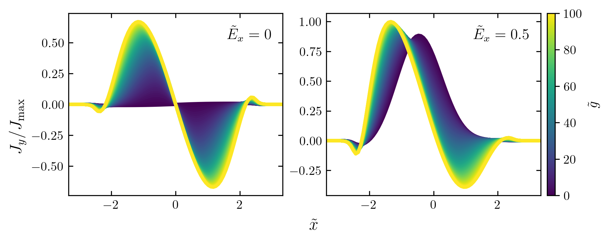
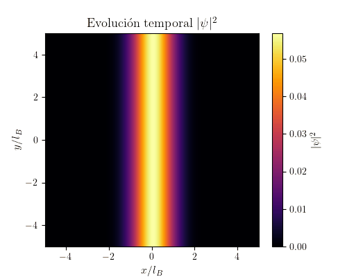

# Spinor Gross-Pitaevskii Split-Step Solver

This repository contains a compact, reproducible implementation of the numerical work used in my bachelor's thesis on spin currents, vortex states and Hall-like transport in a two-component condensate.

The main numerical tool is an imaginary-time split-step method for a two-dimensional Pauli / Gross-Pitaevskii model. It is used to relax vortex and no-vortex branches, compare their energies, and estimate critical values of the interaction strength and magnetic field. The repository also includes the real-time evolution code and the plotting scripts used to generate the final thesis-style current figures.

## Physical Model

The code evolves a two-component spinor wave function

```text
psi(x, y) = (psi_up, psi_down)
```

in a soft-wall potential, with magnetic coupling in Landau gauge, optional electric field, Zeeman splitting and Gross-Pitaevskii nonlinearity. In dimensionless form, the model has the structure

```text
H = kinetic(A) + V(x, y) + g |psi|^2 + Zeeman(B) + electric(E)
```

with the magnetic vector potential written in Landau gauge. Stationary states are obtained by imaginary-time propagation with normalization after each time step.

The observables include the Gross-Pitaevskii energy, the chemical potential and the current decomposition

```text
J = J_orb + J_sigma
```

where `J_orb` is the orbital current and `J_sigma` is the spin current.

## What Is Included

- Imaginary-time split-step evolution for one stationary state.
- Parameter sweeps in interaction strength `g` and magnetic field `B`.
- Energy and chemical-potential diagnostics for the vortex and no-vortex branches.
- Critical crossing plots for `g_c` and `B_c`.
- Orbital, spin and total current visualizations.
- Cross-sections of transverse currents.
- Real-time split-step evolution and a density animation.
- Saved example states and sweep data, so the main figures can be inspected without rerunning every simulation.

## Results

### Critical Energy Crossings

The saved sweep data can be used to compare the vortex and no-vortex branches and mark the estimated critical points.



### Current Panels

The final visualization scripts reproduce the thesis plotting style for the orbital, spin and total currents.



### Current Cross-Sections

The repository also includes the transverse current cross-section plots used to compare different physical configurations.



### Additional Current Figure



### Real-Time Evolution



## Repository Layout

```text
spinor-gp-split-step/
|-- notebooks/
|   |-- 01_imaginary_time_split_step.ipynb
|   |-- 02_critical_sweeps_g_and_B.ipynb
|   `-- 03_real_time_dynamics.ipynb
|-- src/
|   |-- gp2d_split_step.py
|   |-- observables.py
|   |-- plotting.py
|   |-- run_utils.py
|   `-- io_utils.py
|-- scripts/
|   |-- run_single_state.py
|   |-- run_B_sweep.py
|   |-- run_g_sweep.py
|   |-- four_panel_currents_figure.py
|   |-- current_panels_two_cases.py
|   |-- cross_section_currents_two_cases.py
|   `-- make_real_time_video.py
|-- data/
|   |-- example_states/
|   `-- visualization_inputs/
`-- results/
    |-- figures/
    |-- sweeps/
    `-- videos/
```

## Installation

Create a Python environment and install the dependencies:

```bash
pip install -r requirements.txt
```

The notebooks assume that they are launched from the repository root. Each notebook also adds the repository root to `sys.path`, so the local `src/` package can be imported directly.

## Suggested Workflow

1. Open `notebooks/01_imaginary_time_split_step.ipynb` to see the model, the imaginary-time split-step method and single-state diagnostics.
2. Open `notebooks/02_critical_sweeps_g_and_B.ipynb` to load the saved branch sweeps and plot the critical crossings.
3. Open `notebooks/03_real_time_dynamics.ipynb` to evolve a converged state in real time and build the animation.
4. Use the scripts in `scripts/` when a longer run is more convenient outside Jupyter.

## Running a Custom Stationary State

To compute a new stationary state for a chosen configuration:

```bash
python scripts/run_single_state.py --g 50 --B 1 --E 0 --output data/example_states/custom_state.npz
```

This starts from a smooth Gaussian no-vortex seed. To continue from a saved state, for example a vortex branch state:

```bash
python scripts/run_single_state.py ^
  --g 50 --B 1 --E 0.25 ^
  --seed file ^
  --seed-file data/example_states/ground_state_split_step_B1_g50_E0_Lx0.5.npz ^
  --dtau 0.001 ^
  --energy-tolerance 1e-8 ^
  --output data/example_states/vortex_E025.npz
```

On macOS/Linux, replace `^` with `\` for line continuation.

Useful options:

- `--g`, `--B`, `--E`: interaction strength, magnetic field and electric field.
- `--V0`: soft-wall potential height.
- `--wall-fraction-x`: wall position as a fraction of `Lx`.
- `--seed gaussian`, `--seed noise`, `--seed file`: choose the initial condition.
- `--spin-down`: also populate the second spin component for Gaussian/noise seeds.
- `--dtau`, `--max-steps`, `--energy-tolerance`: convergence controls.

The output `.npz` stores the final spinor, grid, physical parameters and convergence diagnostics.

## Running Sweeps

Magnetic-field sweep:

```bash
python scripts/run_B_sweep.py
```

Interaction-strength sweep:

```bash
python scripts/run_g_sweep.py
```

The saved branch data are stored in `results/sweeps/`. These files are used by the critical-crossing notebook, so the energy plots can be reproduced without rerunning the full imaginary-time evolution.

## Real-Time Evolution

The real-time script is designed so that the initial stationary state and the dynamical parameters can be chosen independently. This is useful for the standard quench shown in the animation: load a ground state relaxed at `E=0`, then switch on an electric field during real-time evolution.

```bash
python scripts/make_real_time_video.py ^
  --state data/example_states/ground_state_split_step_B1_g50_E0_Lx0.5.npz ^
  --g 50 --B 1 --E 0.5 ^
  --dt 0.002 --steps 1500 --save-every 20 ^
  --output results/videos/evolucion_tiempo_real.gif
```

The same script also accepts `--V0`, `--wall-fraction-x`, `--wall-steepness`, `--Lx`, `--Ly`, `--N`, `--component`, and other basic model parameters. If an option is not provided, it is read from the input `.npz` whenever possible.

## Reproducing the Thesis Figures

The three main visualization scripts are:

```bash
python scripts/four_panel_currents_figure.py
python scripts/current_panels_two_cases.py
python scripts/cross_section_currents_two_cases.py
```

They load their inputs from `data/visualization_inputs/` and write the final figures to `results/figures/`. These scripts intentionally keep the Matplotlib/LaTeX styling used in the thesis.

If LaTeX is not installed, either install a LaTeX distribution or set `text.usetex` to `False` inside the plotting script.

## Data

The repository includes a small set of example states, visualization inputs and selected sweep outputs. Large simulation outputs are intentionally not included. To create new data, use the sweep scripts or `run_single_state.py`.

